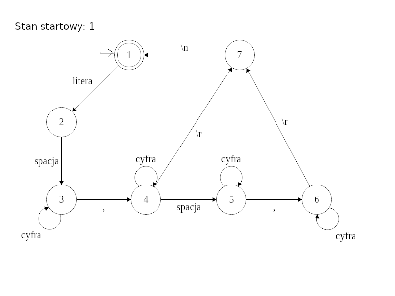
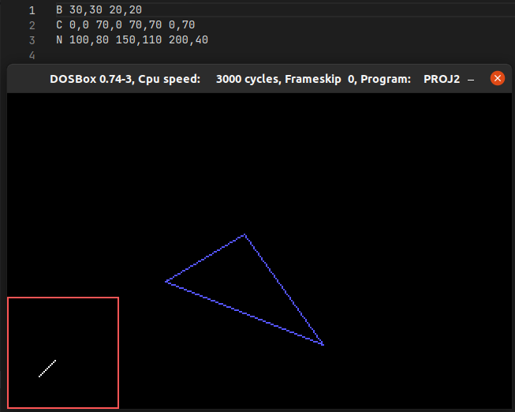

# Polygon viewer

Program was written for x86 assembly classes at AGH UST. It reads data from file (argument) and displays it in graphical mode. Accepted file format is specified using finite automata. Works compiled with MASM on DOSBox

## Usage

\> proj2.exe \<path\>

To exit press ESC

## Implemetation

Drawing lines is implemented with Bresenham's algorithm.

Reading input is implemented using finite automata.

Available Colors:

- B - biały / white
- C - czerwony / red
- Z - zielony / green
- N - niebieski / blue

## Sample output:

